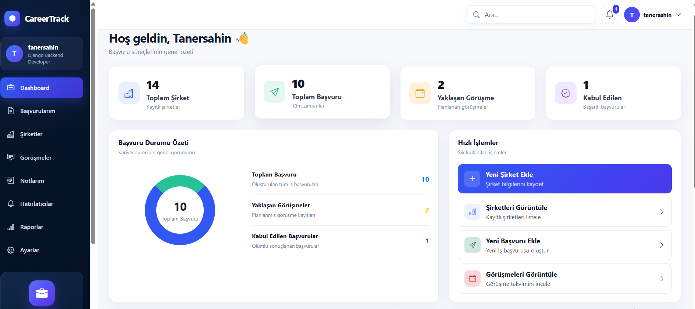
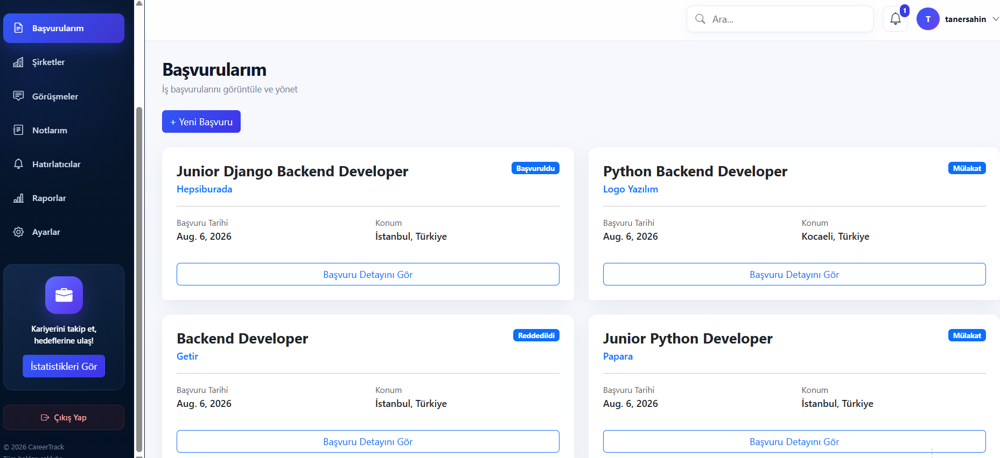
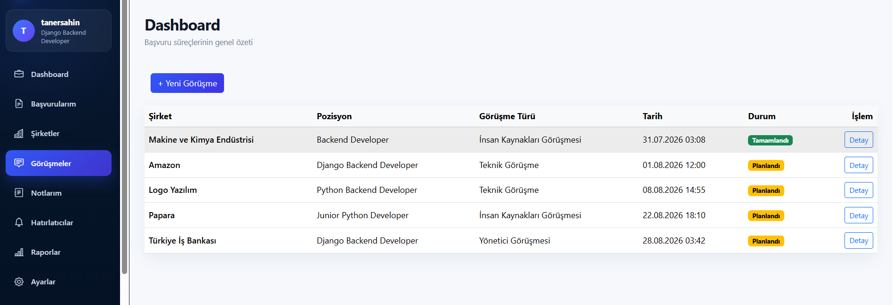
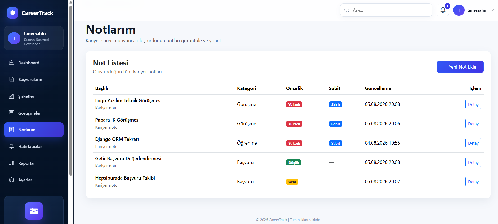
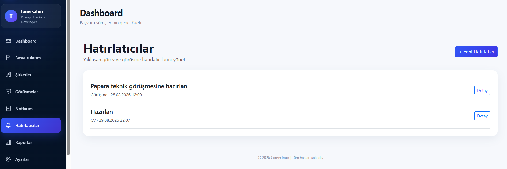
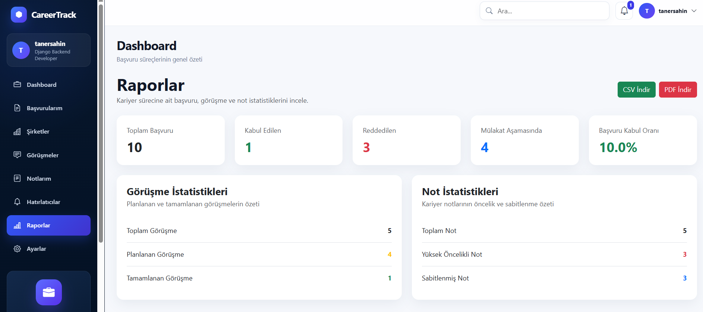

# CareerTrack

🚀 **Live Application:** https://tanersahindev.com

🎬 **Demo Video:** https://github.com/taner-sahin/careertrack/releases/download/v1.0.0/careertrack-demo.mp4

CareerTrack is a production-deployed Django career management application designed to help users organize and track their job search process in one place.

Users can manage companies, job applications, interviews, notes, and reminders while monitoring their progress through advanced reports and statistics.

The application includes secure authentication, strict user data isolation, global search, CSV/PDF export, automated testing, PostgreSQL, and a production deployment stack built with Gunicorn and Nginx.

## Key Highlights

* Django-based backend application
* Production deployment on Ubuntu VPS
* PostgreSQL production database
* Gunicorn application server
* Nginx reverse proxy
* HTTPS/SSL enabled
* Secure authentication and user data isolation
* Company and job application management
* Interview tracking
* Notes and reminders
* Global search
* Advanced reports and statistics
* CSV and PDF export
* 114 automated tests passing
* Project screenshots and demo video

## Features

### Authentication

* User registration, login, and logout
* Login-protected pages and actions
* User-specific data access

### Company Management

* Create, view, update, and delete companies
* Slug-based detail pages
* Companies are owned by individual users
* User isolation for company records
* Company data linked with job applications

### Job Application Management

* Create, view, update, and delete job applications
* Track application status such as applied, interview, accepted, and rejected
* Associate applications with companies
* User-specific application filtering

### Interview Management

* Create and manage interview records
* Track scheduled and completed interviews
* Link interviews to job applications
* User isolation for interview data

### Notes

* Create and manage career notes
* Priority support
* Pin important notes
* User-specific note access

### Reminders

* Create and manage reminders
* User-specific reminder filtering
* Sidebar integration

### Global Search

* Search across companies, applications, interviews, and notes
* Case-insensitive search with Django ORM
* User-specific search results

### Reports and Statistics

* Total applications
* Accepted and rejected application counts
* Interview-stage application count
* Acceptance rate
* Interview rate
* Rejection rate
* Interview completion rate
* Recent applications
* Top company by application count
* Note and interview statistics

### Data Export

* Export applications as CSV
* Export applications as PDF
* UTF-8 BOM support for spreadsheet compatibility
* Turkish character support in PDF
* Login protection and user isolation for export operations

## Tech Stack

### Backend

* Python
* Django 4.2
* Django ORM

### Database

* SQLite for local development
* PostgreSQL for production

### Frontend

* HTML5
* CSS3
* Bootstrap 5

### Testing

* Django TestCase
* Django Test Client
* Automated regression testing

### Export

* Python CSV module
* ReportLab

### Development and Version Control

* Git
* GitHub
* Visual Studio Code

### Production Stack

* Ubuntu 24.04 LTS VPS
* PostgreSQL
* Gunicorn
* Nginx
* Domain and DNS
* Let's Encrypt SSL/HTTPS

## Security and User Isolation

CareerTrack is designed to keep each user's career data private and isolated from other users.

* Authentication is handled with Django's built-in authentication system.
* Protected pages require authenticated users.
* Companies, applications, interviews, notes, and reminders are filtered by the logged-in user.
* Users cannot access or modify another user's private records.
* Detail, update, and delete operations enforce ownership checks.
* Search results are restricted to the authenticated user's data.
* Dashboard statistics are calculated from the authenticated user's records.
* CSV and PDF exports contain only the authenticated user's records.
* Automated tests verify authentication, authorization, ownership, and user isolation behavior.

## Automated Testing

CareerTrack includes a comprehensive automated test suite built with Django's testing framework.

Current test status:

**114 tests passed successfully.**

The test suite covers:

* Model behavior
* Form validation
* Views and HTTP responses
* URL routing
* CRUD operations
* Authentication requirements
* User isolation and ownership protection
* Company isolation
* Search functionality
* Reports and calculated statistics
* Reminders
* CSV export
* PDF export
* Export user isolation
* Regression testing

### Run the Tests

```bash
python manage.py test
```

Expected result:

```text
Ran 114 tests

OK
```

## Project Structure

CareerTrack follows a modular Django application structure.

```text
CareerTrack/
│
├── accounts/        # Authentication and user account operations
├── companies/       # Company management
├── applications/    # Job application management
├── interviews/      # Interview tracking
├── notes/           # Career notes
├── reminders/       # Reminder management
├── reports/         # Reports, statistics, CSV and PDF exports
│
├── config/          # Django project configuration
├── templates/       # Global templates
├── static/          # CSS, JavaScript, images and fonts
├── screenshots/     # Project screenshots
│
├── manage.py
├── requirements.txt
├── .env.example
└── README.md
```

Each Django application is responsible for a specific part of the system, helping keep the project organized, maintainable, and easier to test.

## Installation and Setup

Follow the steps below to run CareerTrack locally.

### 1. Clone the Repository

```bash
git clone https://github.com/taner-sahin/careertrack.git
cd careertrack
```

### 2. Create a Virtual Environment

```bash
python -m venv venv
```

Activate the virtual environment on Windows:

```bash
venv\Scripts\activate
```

### 3. Install Dependencies

```bash
pip install -r requirements.txt
```

### 4. Configure Environment Variables

Create a `.env` file based on the provided `.env.example` file and configure the required environment variables.

### 5. Apply Database Migrations

```bash
python manage.py migrate
```

### 6. Run the Development Server

```bash
python manage.py runserver
```

The application will then be available on the local Django development server.

## Environment Variables

CareerTrack uses environment variables to keep sensitive configuration separate from the source code.

An `.env.example` file is included in the repository as a configuration template.

To configure the project:

1. Copy `.env.example` and rename the copy to `.env`.
2. Add the required local configuration values.
3. Keep the `.env` file private and never commit sensitive credentials to GitHub.

The `.env` file is excluded from version control through `.gitignore`.

## Screenshots

The screenshots below demonstrate the main CareerTrack features and user interface.

### Dashboard

Overview of companies, job applications, upcoming interviews, accepted applications, and quick actions.



### Job Applications

Manage job applications, track application status, and access application details.



### Interviews

Track interview types, scheduled dates, completion status, and related job positions.



### Notes

Manage career notes with categories, priority levels, pinned status, and update tracking.



### Reminders

Create and manage reminders for interviews, CV tasks, and other career activities.



### Reports and Statistics

Monitor application, interview, and note statistics with CSV and PDF export support.



## Demo Video

A short demo video demonstrates the main CareerTrack workflow and key features.

The demo includes:

* Dashboard overview
* Job application management
* Interview tracking
* Notes and reminders
* Global search
* Reports and statistics
* CSV and PDF export

**Demo Video:** https://github.com/taner-sahin/careertrack/releases/download/v1.0.0/careertrack-demo.mp4

The demo video is distributed through the CareerTrack `v1.0.0` GitHub Release.

## Production Deployment

CareerTrack is deployed and running in a production environment.

**Live Application:** https://tanersahindev.com

Production architecture:

```text
Internet
   ↓
Domain / DNS
   ↓
HTTPS / SSL
   ↓
Nginx
   ↓
Gunicorn
   ↓
Django
   ↓
PostgreSQL
```

Production technologies:

* Ubuntu 24.04 LTS VPS
* PostgreSQL
* Gunicorn
* Nginx
* Domain/DNS configuration
* Let's Encrypt SSL certificate
* HTTPS

The application has been tested from external devices and networks to verify public accessibility.

## Future Improvements

Possible future improvements include:

* REST API development with Django REST Framework
* Docker-based containerization
* Redis caching
* Celery for background tasks
* Email notification system
* Improved reporting and data visualization
* Additional production monitoring and logging

## Project Status

CareerTrack's core development, testing, documentation, and production deployment stages are complete.

Current status:

* Core backend development: Complete
* Authentication and user isolation: Complete
* CRUD operations: Complete
* Company user isolation: Complete
* Global Search: Complete
* Reminders: Complete
* Advanced Reports: Complete
* CSV Export: Complete
* PDF Export: Complete
* Automated Tests: **114 tests passing**
* Professional README: Complete
* Project Screenshots: Complete
* Demo Video: Complete
* GitHub Release v1.0.0: Complete
* PostgreSQL Production Database: Complete
* Gunicorn: Complete
* Nginx: Complete
* Domain/DNS: Complete
* SSL/HTTPS: Complete
* Production Deployment: **Complete**
* Live Application: **Online**

---

## Live Application

🚀 **CareerTrack is live at:**

**https://tanersahindev.com**